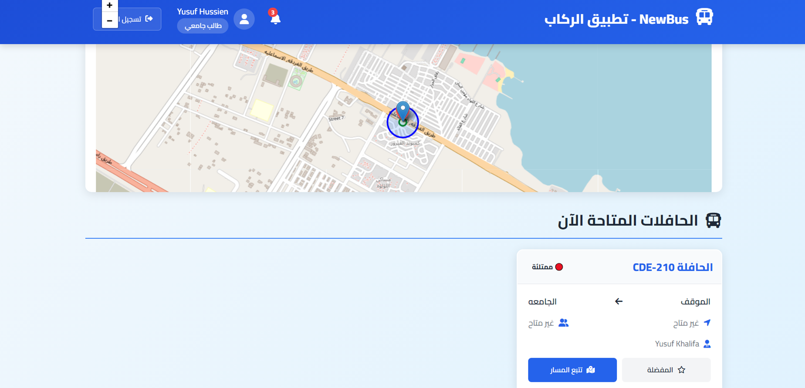
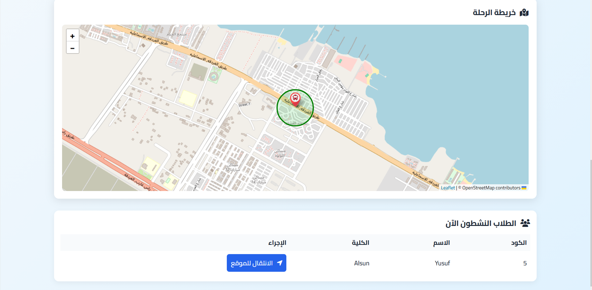
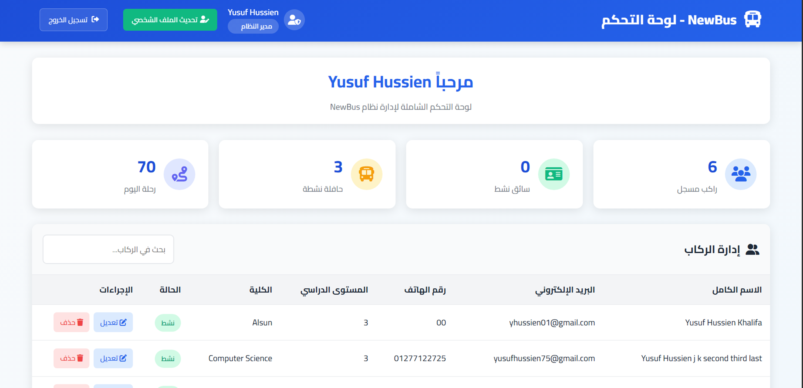

<div align="center">

# 🚌 New Bus App

### Full-Stack University Bus Management System

[](https://newbus.vercel.app)
[](https://newbus.tryasp.net/swagger/index.html)
[](https://github.com/Yusuf-Hussien/New-Bus-App)


---

**A comprehensive real-time bus transportation management system for Hurghada University**  
*Live GPS tracking • Proximity notifications • Role-based dashboards • PWA Support*

[🚀 Live Demo](https://newbus.vercel.app) • [📚 API Documentation](https://newbus.tryasp.net/swagger/index.html) • [🐛 Report Bug](https://github.com/Yusuf-Hussien/New-Bus-App/issues)

</div>

---

## 📋 Table of Contents

- [Overview](#overview)
- [Problem Statement](#problem-statement)
- [✨ Features](#-features)
- [🏗️ Architecture](#️-architecture)
- [🛠️ Tech Stack](#️-tech-stack)
- [📚 Project Structure](#-project-structure)
- [📱 PWA Support](#-pwa-support)
- [🔍 SEO Optimization](#-seo-optimization)
- [🚀 Getting Started](#-getting-started)
- [⚙️ Configuration](#️-configuration)
- [🚢 Deployment](#-deployment)
- [📡 API Documentation](#-api-documentation)
- [🧪 Testing](#-testing)
- [👥 User Roles](#-user-roles)
- [📸 Screenshots](#-screenshots)
- [👥 Team Members](#-team-members)
- [📄 License](#-license)

---

## Overview

**New Bus App** is a comprehensive university team project designed to solve real-world transportation challenges by providing a smart bus management and booking system. The system aims to digitalize bus operations, improve user experience for passengers, and provide administrators with clear control over buses, routes, and finances.

This project is developed collaboratively by a multidisciplinary team, combining backend, frontend, DevOps, UI/UX, and system analysis skills to deliver a modern, scalable, and extensible solution.

---

## Problem Statement

Traditional bus systems often suffer from:

| Problem | Impact |
|---------|--------|
| 📝 **Manual processes** | Time-consuming and error-prone operations |
| 😕 **Poor user experience** | Difficult booking and tracking systems |
| 🔍 **Lack of transparency** | Limited visibility into payments and subscriptions |
| 📊 **Limited financial reporting** | Insufficient analytics for administrators |
| 📍 **No real-time tracking** | Passengers cannot track bus locations |
| 💺 **Inefficient seat management** | Manual seat allocation and availability |

**New Bus App** addresses these challenges by offering a modern, scalable, and extensible solution with real-time capabilities, comprehensive management tools, and an intuitive user interface.

---

## ✨ Features

<table>
<tr>
<td width="50%">

### 🎯 Core Features

- 📍 **Real-time GPS Tracking** - Live bus location updates via SignalR
- 🔔 **Proximity Notifications** - Alerts at 2km and 500m from destination
- 🗺️ **Interactive Maps** - Leaflet-powered route visualization
- 👥 **Multi-role System** - Student, Driver, and Admin dashboards
- 🔐 **Secure Authentication** - JWT with refresh tokens

</td>
<td width="50%">

### 🔧 Advanced Features

- ✉️ **Email Verification** - Account confirmation via email
- 🔑 **Password Reset** - Secure password recovery flow
- ⏰ **Scheduled Tasks** - Quartz.NET background services
- 📊 **Fleet Management** - Complete bus/driver administration
- 🚗 **Trip Control** - Start/stop trips with live updates

</td>
</tr>
</table>

### 🚀 Detailed Functionalities

<details>
<summary><b>👤 User Registration & Authentication</b></summary>

- Secure login system for users, drivers, and administrators
- Email verification with Webhooks
- Password reset functionality
- JWT-based authentication with refresh tokens
- Role-based access control (Student, Driver, Admin)

</details>

<details>
<summary><b>🚌 Bus & Route Management</b></summary>

- Admins can create, update, and manage buses
- Bus status management (Active, Under Maintenance)
- Route creation and management
- Station management along routes
- Faculty-based route organization

</details>

<details>
<summary><b>📅 Trip Scheduling</b></summary>

- Define trips with dates, times, and stops
- Assign buses and drivers to trips
- Station-to-station trip planning
- Trip status management (In Progress, Completed)

</details>

<details>
<summary><b>🗺️ Live Tracking & Navigation</b></summary>

- Track bus location live on interactive maps
- Continuous location updates from drivers
- Display active routes and current bus positions
- Real-time passenger location sharing
- Driver location broadcasting

</details>

<details>
<summary><b>🔔 Real-Time Notifications</b></summary>

- Alert users of bus arrival for each station
- Push notifications when Bus is close (2 Km and 0.5 Km)
- Trip status change notifications
- SignalR integration for live updates

</details>

<details>
<summary><b>🔒 Security & Reliability</b></summary>

- JWT Authentication with secure API endpoints
- Token-based user sessions with refresh mechanism
- Input validation at multiple layers
- Custom exception handling
- Background services for token cleanup (Quartz.NET)

</details>

### 🔄 Future Features (Planned)

| Feature | Description |
|---------|-------------|
| 💳 **Payment Gateway** | Secure payment processing for bookings |
| 🚌 **Subscription Plans** | Monthly/yearly subscription options |
| 📊 **Financial System** | Comprehensive financial reporting for admins |
| 📱 **Mobile Apps** | Cross-platform mobile applications |
| 📈 **Analytics Dashboard** | Detailed analytics and reporting tools |

---

## 🏗️ Architecture

The project follows a **3-Tier N-Layer Architecture** pattern:

```
┌─────────────────────────────────────────────────────────────────┐
│                        PRESENTATION LAYER                        │
│  ┌─────────────┐  ┌─────────────┐  ┌─────────────────────────┐  │
│  │   Web App   │  │  Admin UI   │  │      Driver Panel       │  │
│  │ (Vanilla JS)│  │             │  │                         │  │
│  └─────────────┘  └─────────────┘  └─────────────────────────┘  │
└─────────────────────────────────────────────────────────────────┘
                              │
                              ▼
┌─────────────────────────────────────────────────────────────────┐
│                      ASP.NET Core Web API                        │
│  ┌──────────────────────────────────────────────────────────┐   │
│  │                    Controllers Layer                      │   │
│  │   Auth │ Bus │ Driver │ Trip │ Student │ Notification    │   │
│  └──────────────────────────────────────────────────────────┘   │
│                              │                                   │
│  ┌──────────────────────────────────────────────────────────┐   │
│  │                    Business Logic Layer                   │   │
│  │              Services │ SignalR Hubs │ Quartz Jobs        │   │
│  └──────────────────────────────────────────────────────────┘   │
│                              │                                   │
│  ┌──────────────────────────────────────────────────────────┐   │
│  │                    Data Access Layer                      │   │
│  │          Repository Pattern │ Unit of Work │ EF Core      │   │
│  └──────────────────────────────────────────────────────────┘   │
└─────────────────────────────────────────────────────────────────┘
                              │
                              ▼
┌─────────────────────────────────────────────────────────────────┐
│                         SQL Server Database                      │
└─────────────────────────────────────────────────────────────────┘
```

### Key Design Patterns

| Pattern | Purpose |
|---------|---------|
| 🏛️ **N-Tier Architecture** | Separation of concerns across layers |
| 📦 **Repository Pattern** | Abstraction over data access |
| 🔄 **Unit of Work** | Transaction management |
| 💉 **Dependency Injection** | Loose coupling & testability |
| 🎯 **DTO Pattern** | Data transfer between layers |
| 🗺️ **AutoMapper** | Object-to-object mapping |

---

## 🛠️ Tech Stack

<table>
<tr>
<td align="center" width="33%">

### Backend


- ASP.NET Core Web API
- Entity Framework Core
- SignalR (Real-time)
- Quartz.NET (Scheduling)
- AutoMapper
- FluentValidation
- JWT Authentication

</td>
<td align="center" width="33%">

### Frontend


- Vanilla JavaScript (ES6+)
- HTML5 & CSS3
- Leaflet Maps API
- Service Workers (PWA)
- Responsive Design
- SignalR Client

</td>
<td align="center" width="33%">

### DevOps


- Vercel (Frontend)
- MonsterASP.NET (Backend)
- SQL Server
- Swagger/OpenAPI
- Git & GitHub
- Unit Testing (xUnit)

</td>
</tr>
</table>

---


# 📚 Project Structure

<details>
<summary><b>Click to expand</b></summary>

```
New-Bus-App/
│
├── Backend/
│   ├── NewBusProject/
│   │   ├── NewBusAPI/                 # Presentation Layer (ASP.NET Core API)
│   │   │   ├── Controllers/           # API Controllers
│   │   │   │   ├── AdminsController.cs
│   │   │   │   ├── AuthController.cs
│   │   │   │   ├── BusesController.cs
│   │   │   │   ├── DriversController.cs
│   │   │   │   ├── FacultiesController.cs
│   │   │   │   ├── GeneralController.cs
│   │   │   │   ├── RoutesController.cs
│   │   │   │   ├── StationsController.cs
│   │   │   │   ├── StudentsController.cs
│   │   │   │   └── TripsController.cs
│   │   │   │
│   │   │   ├── SignalR/               # Real-time Communication
│   │   │   │   └── LiveHub.cs
│   │   │   │
│   │   │   ├── Middleware/            # Custom Middlewares
│   │   │   ├── BackgroundServices/    # Quartz.NET Jobs
│   │   │   ├── Program.cs             # Entry Point
│   │   │   └── appsettings.json       # Configuration
│   │   │
│   │   ├── NewBusBLL/                 # Business Logic Layer
│   │   │   ├── Admins/
│   │   │   ├── Buses/
│   │   │   ├── Drivers/
│   │   │   ├── EmailService/
│   │   │   ├── Exceptions/
│   │   │   ├── RefreshToken/
│   │   │   ├── Routes/
│   │   │   ├── Stations/
│   │   │   ├── Students/
│   │   │   └── Trips/
│   │   │
│   │   └── NewBusDAL/                 # Data Access Layer
│   │       ├── Models/
│   │       ├── Repositories/
│   │       ├── DTOs/
│   │       └── Migrations/
│   │
│   └── NewBusTest/                    # Unit Tests
│
├── Frontend/                          # Vanilla JS + PWA
│   ├── admin.html
│   ├── driver.html
│   ├── passenger.html
│   ├── login.html
│   ├── admin/
│   ├── driver/
│   ├── passenger/
│   ├── login/
│   ├── config.js
│   ├── manifest.json
│   └── service-worker.js
│
├── Documentation/
│   ├── PHI_Project_Proposal.pdf
│   ├── PHI_Team_Info.pdf
│   ├── SRS_New_Bus_Management_System.pdf
│   ├── User_Manual.pdf
│   └── project_scheduling.png
│
├── vercel.json
└── README.md
```

</details>

---

## 📱 PWA Support

New Bus App is a **Progressive Web App** that provides a native-like experience:

| Feature | Status | Description |
|---------|--------|-------------|
| 📲 **Installable** | ✅ | Add to home screen on any device |
| 📴 **Offline Support** | ✅ | Core features work without internet |
| ⚡ **Fast Loading** | ✅ | Service worker caching |
| 🔔 **Push Notifications** | ✅ | Real-time bus alerts |
| 📱 **Responsive** | ✅ | Optimized for all screen sizes |
| 🔄 **Auto Updates** | ✅ | Seamless app updates |

### Installation

<details>
<summary><b>📱 On Mobile (iOS/Android)</b></summary>

1. Open [newbus.vercel.app](https://newbus.vercel.app) in your browser
2. **iOS**: Tap Share → "Add to Home Screen"
3. **Android**: Tap Menu → "Install App" or "Add to Home Screen"

</details>

<details>
<summary><b>💻 On Desktop (Chrome/Edge)</b></summary>

1. Visit [newbus.vercel.app](https://newbus.vercel.app)
2. Click the install icon (➕) in the address bar
3. Click "Install"

</details>

---

## 🔍 SEO Optimization

New Bus App is fully optimized for search engines:

```html
<!-- Bilingual Support (Arabic/English) -->
<html lang="ar" dir="rtl">

<!-- Comprehensive Meta Tags -->
<title>New Bus | نيو باص - خدمة الباصات الجامعية في الغردقة</title>

<!-- Open Graph & Twitter Cards -->
<meta property="og:title" content="New Bus | نيو باص" />
<meta name="twitter:card" content="summary_large_image" />

<!-- Geo-targeting for Hurghada -->
<meta name="geo.region" content="EG-GH" />
<meta name="geo.placename" content="Hurghada" />
```

### SEO Features

| Feature | Status |
|---------|--------|
| 🌍 **Bilingual meta tags** | ✅ Arabic + English |
| 📱 **Open Graph tags** | ✅ Social sharing |
| 🐦 **Twitter Cards** | ✅ Rich previews |
| 🔗 **Canonical URLs** | ✅ SEO best practices |
| 📍 **Geo-targeting** | ✅ Hurghada, Egypt |
| 📄 **Semantic HTML** | ✅ Accessibility |
| 📱 **Mobile-first** | ✅ Responsive design |

---

## 🚀 Getting Started

### Prerequisites

- [.NET 8 SDK](https://dotnet.microsoft.com/download/dotnet/8.0)
- [SQL Server](https://www.microsoft.com/en-us/sql-server/sql-server-downloads) (2019 or higher)
- [Git](https://git-scm.com/) (for version control)
- [Visual Studio 2022](https://visualstudio.microsoft.com/) or VS Code

### Backend Setup

```bash
# Clone the repository
git clone https://github.com/Yusuf-Hussien/New-Bus-App.git
cd New-Bus-App

# Navigate to backend directory
cd Backend/NewBusProject/NewBusAPI

# Restore dependencies
dotnet restore

# Update database
dotnet ef database update --project ../NewBusDAL

# Run the application
dotnet run
```

The API will be available at `https://localhost:5089`

### Frontend Setup

```bash
# Navigate to frontend directory
cd Frontend

# Option 1: Use VS Code Live Server extension
# Option 2: Python HTTP Server
python -m http.server 5500

# Option 3: Node.js HTTP Server
npx http-server -p 5500
```

Access at `http://localhost:5500`

---

## ⚙️ Configuration

### Backend Configuration

Create `appsettings.Development.json`:

```json
{
  "ConnectionStrings": {
    "myconn": "Server=localhost;Database=NewBusDB;Trusted_Connection=True;TrustServerCertificate=True;"
  },
  "JWT": {
    "SecretKey": "your-very-long-secret-key-minimum-32-characters"
  },
  "PasswordEmail": "your-email-app-password",
  "EmailFrom": "noreply@newbusapp.com",
  "FrontEndDomainLogin": "http://localhost:5500",
  "FailedVerirfingEmail": "http://localhost:5500/login.html?error=verification",
  "PageResetPassword": "http://localhost:5500/reset-password.html"
}
```

### Frontend Configuration

Update `Frontend/config.js`:

```javascript
const CONFIG = {
  BASE_API_URL: "https://newbus.tryasp.net/"  // or your local backend URL
};
```

### CORS Configuration

Update allowed origins in `Program.cs`:

```csharp
policy.WithOrigins(
    "http://127.0.0.1:5500",
    "https://newbus.vercel.app",
    "https://new-bus-app.vercel.app"
)
```

---

## 🚢 Deployment

### Frontend Deployment (Vercel)

1. **Push to GitHub**
   ```bash
   git add .
   git commit -m "Prepare for deployment"
   git push origin main
   ```

2. **Deploy on Vercel**
   - Go to [Vercel](https://vercel.com/new)
   - Import your GitHub repository
   - Leave Root Directory as root (`.`)
   - Click "Deploy"

3. **Done!** Your site is live at `newbus.vercel.app`

### Backend Deployment

<details>
<summary><b>Option 1: ASP.NET Hosting (tryasp.net)</b></summary>

```bash
cd Backend/NewBusProject/NewBusAPI
dotnet publish -c Release -o ./publish
```

Upload the publish folder via FTP/Web Deploy.

</details>

<details>
<summary><b>Option 2: Azure App Service</b></summary>

1. Create a new Web App in Azure Portal
2. Configure SQL Database connection
3. Deploy via Visual Studio publish wizard

</details>

<details>
<summary><b>Option 3: Docker</b></summary>

```dockerfile
FROM mcr.microsoft.com/dotnet/aspnet:8.0 AS base
WORKDIR /app
EXPOSE 80

FROM mcr.microsoft.com/dotnet/sdk:8.0 AS build
WORKDIR /src
COPY . .
RUN dotnet publish -c Release -o /app/publish

FROM base AS final
COPY --from=build /app/publish .
ENTRYPOINT ["dotnet", "NewBusAPI.dll"]
```

```bash
docker build -t newbus-api .
docker run -p 8080:80 newbus-api
```

</details>

### Post-Deployment Checklist

- [ ] Update frontend `config.js` with production API URL
- [ ] Configure CORS on backend for frontend domain
- [ ] Set up SSL certificates (HTTPS)
- [ ] Configure production database connection
- [ ] Set secure JWT secret key
- [ ] Enable logging and monitoring
- [ ] Test all API endpoints
- [ ] Verify SignalR connections
- [ ] Test authentication flow
- [ ] Verify email service configuration

---

## 📡 API Documentation

Full API documentation available at **[Swagger UI](https://newbus.tryasp.net/swagger/index.html)**

### Base URLs

| Environment | URL |
|------------|-----|
| **Production** | `https://newbus.tryasp.net/api/` |
| **Development** | `http://localhost:5089/api/` |
| **Swagger UI** | `https://newbus.tryasp.net/swagger/index.html` |

### Authentication

All protected endpoints require JWT authentication:

```
Authorization: Bearer <your-jwt-token>
```


### SignalR Hub

- **Hub Path**: `/LiveHub`
- **Connection**: Real-time location updates and notifications
- **Authentication**: JWT token via query parameter `access_token`

---

## 🧪 Testing

### Running Unit Tests

```bash
cd Backend/NewBusTest/NewBusBLLTest
dotnet test
```

### Manual Testing

1. **API Testing** - Use Swagger UI at `/swagger`
2. **Frontend Testing** - Test all user roles
3. **Integration Testing** - Test end-to-end flows

---

## 👥 User Roles

<table>
<tr>
<td align="center" width="33%">

### 🎓 Student

- View available buses
- Track bus in real-time
- Receive proximity alerts
- View trip history
- Share live location

</td>
<td align="center" width="33%">

### 🚐 Driver

- Start/Stop trips
- Share live location
- View assigned routes
- Manage trip status
- View passenger locations

</td>
<td align="center" width="33%">

### 👨‍💼 Admin

- Manage all users
- Fleet management
- Route configuration
- Analytics dashboard
- Schedule control

</td>
</tr>
</table>

---

## 📸 Screenshots

<div align="center">

| Passenger View | Driver Dashboard | Admin Panel |
|:------------:|:----------------:|:-----------:|
|  |  |  |

</div>

---

## 📖 Documentation

### Available Documentation

| Document | Description |
|----------|-------------|
| 📄 [Project Proposal](./Documentation/PHI_Project_Proposal.pdf) | Initial project proposal and scope |
| 👥 [Team Information](./Documentation/PHI_Team_Info.pdf) | Team member details and roles |
| 📋 [SRS Document](./Documentation/SRS%20New%20Bus%20Management%20System.pdf) | Software Requirements Specification |
| 📚 [User Manual](./Documentation/User%20Manual%20.pdf) | End-user guide and instructions |
| 📅 [Project Schedule](./Documentation/project_scheduling.png) | Project timeline and milestones |

---

## 👥 Team Members

<div align="center">

| Role | Name |
|------|------|
| 📊 **Business & System Analysis** | [Ahmed Abdelhady](https://github.com/ahmedabdelhady100) |
| 🖌️ **UI/UX & Visual Design** | [Amr Desouki](https://github.com/amrdesouki1) |
| 🎨 **Frontend Developer** | [Ahmed Ibrahim](https://github.com/A7med-Ibrahem) |
| 👨‍💻 **Backend & Real-Time Features** | [Kareem Ayman](https://github.com/kemo225) |
| 🔧 **Backend & DevOps (Team Lead)** | [Yusuf Hussien](https://github.com/Yusuf-Hussien) |

*University Project • Hurghada University • 2025-2026*

</div>

## 📄 License

This project is licensed under the MIT License - see the [LICENSE](LICENSE) file for details.

---

## 🤝 Contributing

This is a university team project. For contributions or questions, please contact the team members or create an issue in the repository.

---

## 📧 Support

For support, please refer to the documentation files in the `Documentation/` directory or contact the development team.

---

<div align="center">

**Made with ❤️ for Hurghada University**

[](https://newbus.vercel.app)
[](https://newbus.tryasp.net/swagger/index.html)

**Last Updated**: January 2026 | **Version**: 1.0.0

</div>